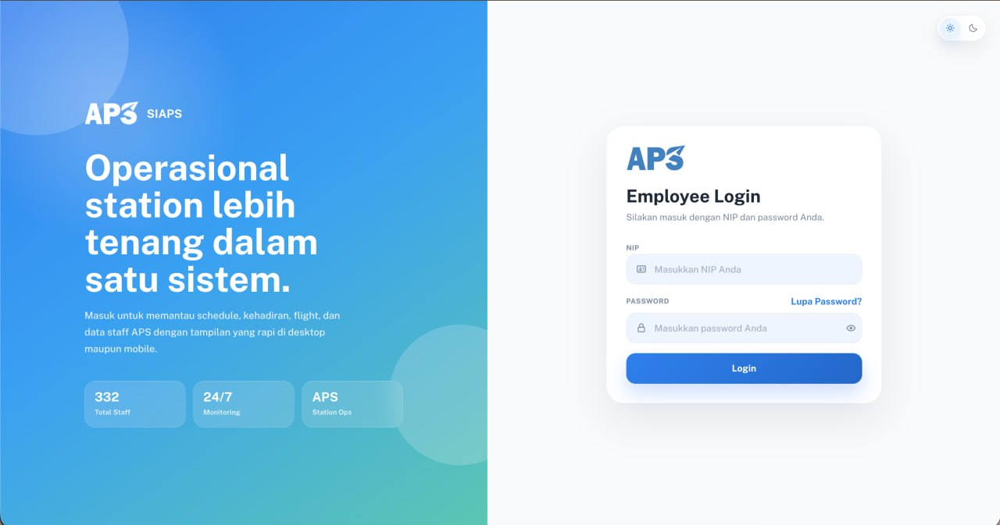
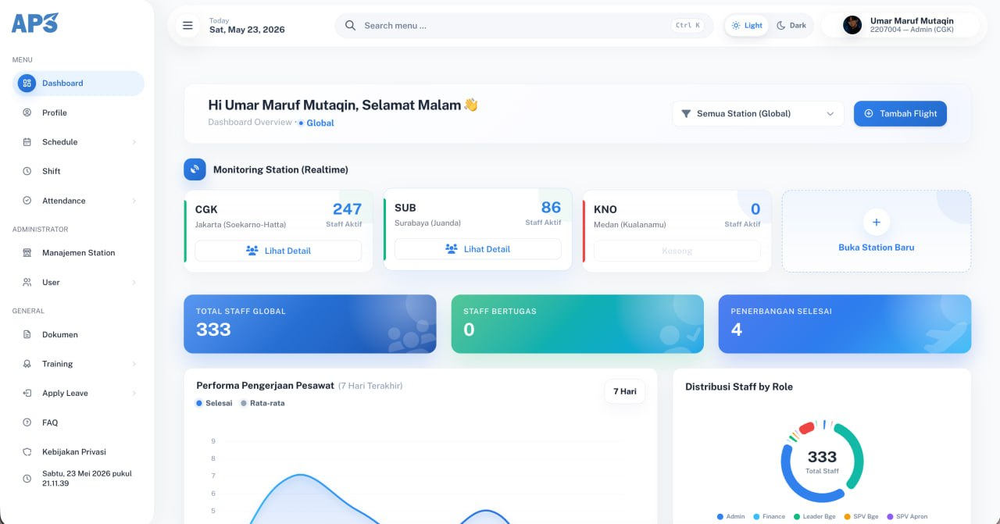
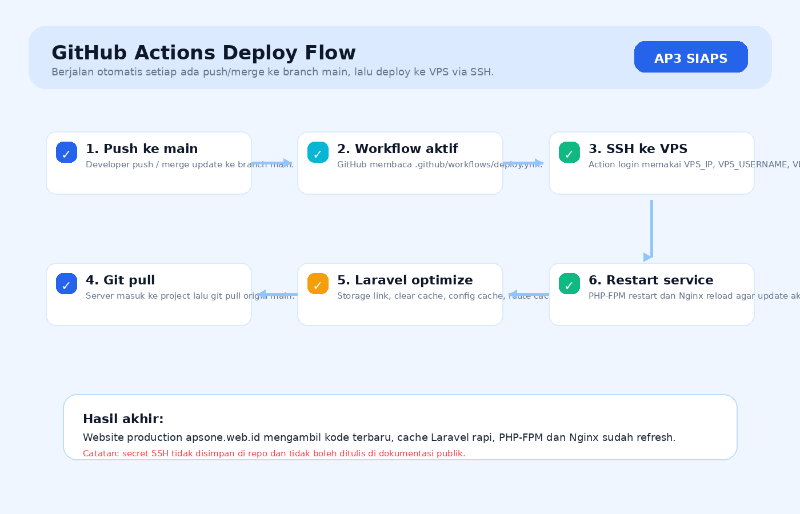
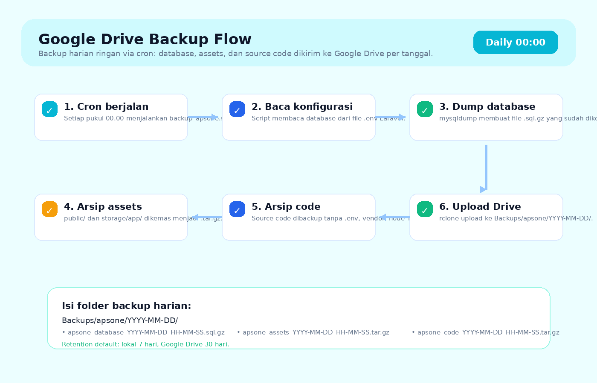

# AP3 SIAPS

AP3 SIAPS adalah aplikasi web operasional station berbasis Laravel untuk membantu monitoring staff APS, schedule, shift, attendance, flight, training, cuti, lembur, dokumen, dan manajemen station dalam satu sistem.

Aplikasi ini dibuat agar aktivitas operasional station lebih mudah dipantau oleh admin maupun user, dengan tampilan desktop dan mobile yang rapi.

---

## Tampilan Aplikasi

### Login Page



Halaman login digunakan oleh employee untuk masuk menggunakan NIP dan password. Di halaman ini tersedia informasi singkat sistem, total staff, monitoring 24/7, dan akses forgot password.

### Dashboard Overview



Dashboard utama menampilkan ringkasan operasional station, jumlah staff aktif per station, total staff global, staff bertugas, penerbangan selesai, grafik performa pengerjaan pesawat, dan distribusi staff berdasarkan role.

---

## Fungsi Utama Program

AP3 SIAPS dipakai untuk:

- Login employee menggunakan NIP dan password.
- Monitoring dashboard operasional station secara realtime.
- Mengelola data staff APS.
- Import dan export data staff.
- Mengelola station dan status aktif/nonaktif station.
- Mengelola schedule dan shift staff.
- Mencatat dan memantau attendance atau absensi.
- Mengelola data flight dan detail pengerjaan pesawat.
- Mengelola pengajuan cuti.
- Mengelola overtime atau lembur beserta approval.
- Mengelola training dan certificate staff.
- Mengelola user, profile, kontrak, PAS bandara, dan data tim.
- Menyediakan halaman dokumen, FAQ, dan kebijakan privasi.
- Membuat laporan/export untuk kebutuhan administrasi.

---

## Teknologi yang Digunakan

- Backend: Laravel 12
- PHP: minimal PHP 8.2
- Database: MySQL/MariaDB
- Frontend build tool: Vite
- Styling: Tailwind CSS
- Export Excel: maatwebsite/excel
- PDF: barryvdh/laravel-dompdf
- Alert UI: realrashid/sweet-alert
- Web server production: Nginx
- Runtime production: PHP-FPM

---

## Struktur Modul

### Authentication

Mengatur login, logout, OTP, forgot password, change password, dan update password.

Route utama:

```text
/
actionlogin
logout
verify-otp
forgot-password
```

### Dashboard

Menampilkan overview operasional station, data staff, flight, station aktif, grafik performa, dan informasi user yang sedang login.

Route utama:

```text
/home
```

### Staff Management

Mengelola data staff, import/export staff, download template, dan toggle status staff.

Route utama:

```text
/staff-data
/staff/export
/staff/import
/staff/template
/staff/toggle/{id}
```

### Station Management

Mengelola station, membuat station baru, edit station, hapus station, dan mengaktifkan/nonaktifkan station.

Route utama:

```text
/stations
/stations/create
/stations/store
/stations/toggle/{id}
```

### Flight Management

Mengelola data penerbangan dan detail staff yang terlibat pada flight.

Route utama:

```text
/flights
/flights/{id}/details
/flight/{id}/users
```

### Schedule dan Shift

Mengelola jadwal kerja, import schedule, auto create schedule, update schedule, schedule freelance, dan master shift.

Route utama:

```text
/schedule
/schedule/import
/schedule/auto-create
/schedule-now
/shift
```

### Attendance

Mencatat check-in, check-out, proses absensi, history attendance, report, dan export attendance.

Route utama:

```text
/attendance
/attendance/camera
/attendance/check-in
/attendance/check-out
/attendance/history
/attendance/reports
/attendance/export
```

### Leave Management

Mengelola pengajuan cuti, daftar cuti pribadi, approval cuti, laporan cuti, status cuti, dan export cuti.

Route utama:

```text
/leaves/apply
/my-leaves
/leaves/pengajuan
/leaves/approval
/leaves/laporan
/leaves/export
```

### Training dan Certificate

Mengelola certificate/training staff dari sisi user dan admin.

Route utama:

```text
/my-certificates
/training
/training/create
/admin/training/certificates
```

### Overtime

Mengelola lembur staff, pengajuan lembur, approval leader, reject/approve, report admin, dan export lembur.

Route utama:

```text
/overtime
/overtime/create
/overtime/approval
/overtime/report
/overtime/export
```

---

## Cara Running di Local Development

### 1. Clone Repository

```bash
git clone https://github.com/takahashiumaru/project-work-uaps.git
cd project-work-uaps
```

### 2. Install Dependency PHP

```bash
composer install
```

### 3. Install Dependency Frontend

```bash
npm install
```

### 4. Buat File Environment

```bash
cp .env.example .env
php artisan key:generate
```

Edit file `.env`, lalu sesuaikan konfigurasi database:

```env
DB_CONNECTION=mysql
DB_HOST=127.0.0.1
DB_PORT=3306
DB_DATABASE=nama_database
DB_USERNAME=user_database
DB_PASSWORD=password_database
```

### 5. Jalankan Migrasi Database

```bash
php artisan migrate
```

Jika project membutuhkan seed data, jalankan:

```bash
php artisan db:seed
```

### 6. Buat Storage Link

```bash
php artisan storage:link
```

### 7. Jalankan Laravel dan Vite

Terminal pertama:

```bash
php artisan serve
```

Terminal kedua:

```bash
npm run dev
```

Buka aplikasi di browser:

```text
http://127.0.0.1:8000
```

---

## Cara Running Menggunakan Composer Dev

Project juga memiliki command development bawaan Laravel yang menjalankan server, queue listener, log pail, dan Vite secara bersamaan.

```bash
composer run dev
```

Gunakan cara ini jika semua dependency sudah terinstall dan ingin menjalankan beberapa proses development sekaligus.

---

## Cara Build Frontend

Untuk membuat asset production:

```bash
npm run build
```

Hasil build akan digunakan Laravel melalui Vite manifest.

---

## Cara Running di Production Server

Production server berjalan tanpa Docker. Stack yang digunakan:

- Nginx sebagai web server.
- PHP 8.3-FPM sebagai runtime Laravel.
- MySQL/MariaDB sebagai database.
- SSL dari Let’s Encrypt.
- Deploy menggunakan GitHub Actions via SSH, lalu `git pull` di server.

Alur deploy production:

```bash
cd /home/ubuntu/project-work-uaps
git pull origin main
composer install --no-dev --optimize-autoloader
npm install
npm run build
php artisan storage:link
php artisan config:clear
php artisan route:clear
php artisan view:clear
php artisan cache:clear
php artisan optimize
sudo systemctl restart php8.3-fpm
sudo systemctl reload nginx
```

Website production:

```text
https://apsone.web.id
```

### Dokumentasi Singkat GitHub Actions Deploy



Workflow deploy akan berjalan otomatis setiap ada `push` ke branch `main`.

Alur singkatnya:

1. Developer melakukan push atau merge ke `main`.
2. GitHub Actions membaca file `.github/workflows/deploy.yml`.
3. Action login ke VPS menggunakan secret `VPS_IP`, `VPS_USERNAME`, dan `VPS_SSH_KEY`.
4. Server masuk ke folder project lalu menjalankan `git pull origin main`.
5. Laravel merapikan permission, refresh `storage:link`, lalu clear/cache/optimize.
6. PHP-FPM direstart dan Nginx direload agar update langsung aktif di production.

Jadi fungsi workflow ini adalah membuat deploy production lebih cepat, konsisten, dan tidak perlu upload manual file satu per satu.

---

## Backup Otomatis

Project memiliki script backup harian untuk database, assets, dan source code.

File script:

```text
backup/backup_apsone.sh
```

Tujuan backup Google Drive:

```text
gdrive:Backups/apsone/YYYY-MM-DD/
```

Isi folder backup harian:

```text
apsone_database_YYYY-MM-DD_HH-MM-SS.sql.gz
apsone_assets_YYYY-MM-DD_HH-MM-SS.tar.gz
apsone_code_YYYY-MM-DD_HH-MM-SS.tar.gz
```

Cron backup otomatis:

```cron
0 0 * * * /home/ubuntu/project-work-uaps/backup/backup_apsone.sh >/dev/null 2>&1
```

Dokumentasi detail backup ada di:

```text
backup/README.md
```

### Dokumentasi Singkat Alur Backup Harian



Backup berjalan otomatis setiap hari pukul 00.00 melalui cron.

Alur singkatnya:

1. Cron menjalankan script `backup_apsone.sh` setiap pukul 00.00.
2. Script membaca konfigurasi database dari file `.env` Laravel.
3. Database di-dump menggunakan `mysqldump` lalu dikompresi menjadi `.sql.gz`.
4. Folder `public/` dan `storage/app/` dikemas menjadi arsip `.tar.gz` untuk assets.
5. Source code project dibackup tanpa file `.env`, `vendor/`, `node_modules/`, dan `.git/`.
6. Semua file backup diunggah ke Google Drive menggunakan `rclone` ke folder `Backups/apsone/YYYY-MM-DD/`.

Jadi fungsi backup ini adalah menjaga data production tetap aman dan bisa dipulihkan kapan saja jika terjadi masalah server atau human error.

---

## Catatan Keamanan

- Jangan commit file `.env`.
- Jangan commit credential Google Drive/rclone.
- Jangan commit hasil backup `.sql.gz` atau `.tar.gz`.
- Jangan commit file log production.
- Pastikan folder `storage/` dan `bootstrap/cache/` writable oleh web server.
- Pastikan APP_DEBUG bernilai `false` di production.

---

## Troubleshooting Umum

### View tidak ditemukan di Linux

Linux bersifat case-sensitive. Jika Laravel mencari `staff.index`, maka folder view harus bernama:

```text
resources/views/staff/
```

Bukan:

```text
resources/views/Staff/
```

### Asset tidak muncul

Jalankan ulang storage link dan build frontend:

```bash
php artisan storage:link
npm run build
php artisan optimize
```

### Cache Laravel bermasalah

Bersihkan cache lalu optimize ulang:

```bash
php artisan config:clear
php artisan route:clear
php artisan view:clear
php artisan cache:clear
php artisan optimize
```

### Backup gagal upload

Cek koneksi rclone:

```bash
rclone lsd gdrive:
```

Cek log backup:

```bash
tail -100 /home/ubuntu/project-work-uaps/backup/logs/backup.log
```

---

## Status Production Saat Ini

- Domain: https://apsone.web.id
- Deployment: native VPS, tanpa Docker
- Web server: Nginx
- PHP service: php8.3-fpm
- Backup: aktif harian pukul 00.00
- Google Drive backup: folder per tanggal
